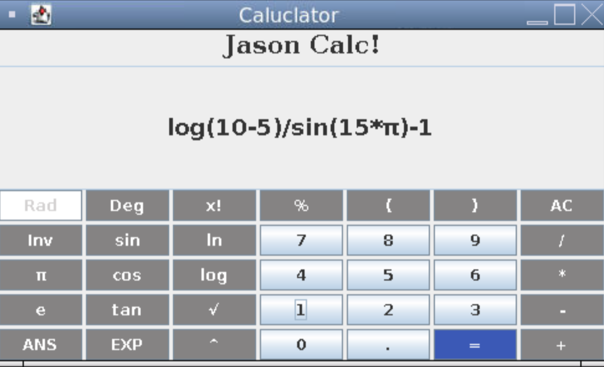
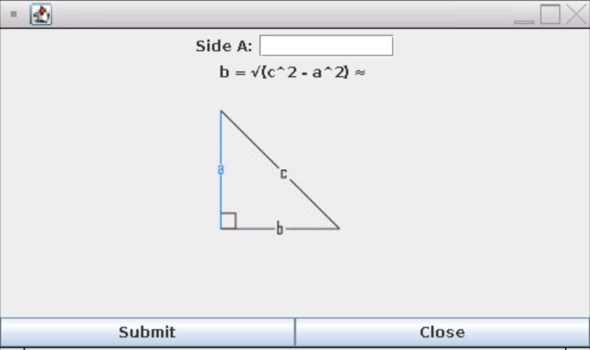
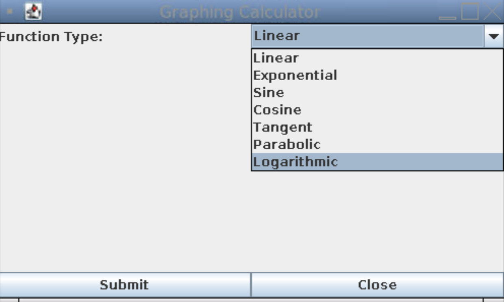
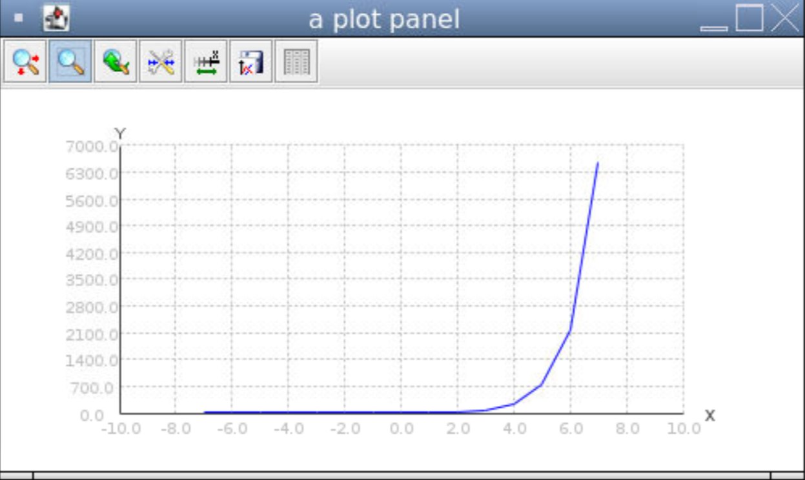

4/07/2022: I researched my topic and brainstormed some ideas for the final decision and outlined by work progress. My peers and I had first-hand experience for some possible ISP projects like an ATM, Caclulator, Airline reservations system and many others.

4/10/2022: Decided on creating an airlines reservations system. Will implement many features from choosing which class to fly, display boarding pass, multiple user accounts, air miles system, and many other features. Started making basic JFrame and planned some features out.

4/11/2022: Completed proposal and decided on multiple features. Decided on removing Boarding Pass display and replaced it with price discrimination.

4/19/2022: Switched ISP to visualising my Unit 4 Task of a calculator into java swing. Here is what I started working with:\


4/21/2022: I statred exprimenting more with creating classes and constructors, as well as the Graphics class of java swing. Created a visual display for graphing and changed button to display. Also rewrote the proposal. This is a snippet of my Graphing class: 
```java
Graphics2D g1 = (Graphics2D) g;
g1.setStroke(new BasicStroke(2));
g1.setColor(Color.black);
g1.drawLine(0,h,w*2,h);
g1.drawLine(w,0,w,h*2);
g1.drawString("0", w - 7, h + 13);
Graphics2D g2 = (Graphics2D) g;
g2.setStroke(new BasicStroke(2));
g2.setColor(Color.red);
Polygon p = new Polygon();
double a = 1.0/2.0;
double b = 0.5;
for (int x = -150; x <= 150; x++) {
  p.addPoint(w+x,h-((int) ((double) a*x * x)));
}
g2.drawPolyline(p.xpoints, p.ypoints, p.npoints);
```

4/22/2022: Completed proposal and researched further on the possibilities of Java Swing's Graphing library. I read more upon the official documentation of graphics and the fundamentals of java swing.

4/23/2022: Tried to implement a CardLayout interface but placing a CardLayout within another CardLayout appears to be impossible. 
Here is a snippet of my code:
```java
class Cardlayout extends JFrame{
  CardLayout card;
  public static JButton b1, b2, b3, b4, b5, b6, b7, b8, b9, b10, b11, b12, b13, b14, b15, b16, b17, b18, b19, b20, b21, bf1, bf2, bf3, bf4, bf5, bf6, bf7, bf8, bf9, bf10, bf11, bf12, bf13, bf14, bf15, bf16;
  Container c;
  //constructor
  Cardlayout(){
  c = getContentPane();
  card = new CardLayout(500,500);
  c.setLayout(card);

  ...
  //creating buttons and panels
  ...
}
  //method to run when an action is performed on a button
  public void actionPerformed(ActionEvent e){
    // call the next card
    card.next(c);
  }
```
Did some research on OOPs and computing mathematical constants.

4/24/2022: Worked on how to design the function interface and passing parameters through constructors. Researched more on OOPs and graphing.

4/26/2022: Completed Pythagorean button's individual features and researched more about computation and OOPs classes. Here is an example of the pythagorean button. Here it is:


4/27/2022: Researched how to compute Pi in java and completed the Pi estimation button. Used random number generator and a mathematical formula to find it. Here is the formula:

4/28/2022: Researched how to compute Euler's number in java and completed the Euler estimation button. Began work on Sieve of Eratosthenes and creating images for pythagorean display.

4/29/2022: Learned how to use packages in Java and completed a working Sieve of Eratosthenes button to find primes. Also started working on the graphing features of the program. Added pictures to the pytagorean theorum graph as well. Here is a quick look at my graphing interface:



4/30/2022: Almost completed the final calculator model. Having trouble graphing logarithmic graphs, and tangent graphs look odd. Also working on the learning button for the funcs frame. There is a problem where some JFrames don't update.

5/1/2022: Added some finishing touches to the proposal, and am conisdering removing the learn button. Fixed almost all bugs, including the JFrame bug. All i need to do is figure out logarithmic graphs, weird function button and maybe the learn button.

5/3/2022: Im not sure why the log graph doesn't graph properly, so I just removed the option of a logarithmic graph. 

5/5/2022: Started working on my learn buttons. It takes quite a while to write the paragraphs and learn how to use a jscrollpane, but it allows me to display large amounts of text in a small area.

5/10/2022: Finished the enitre calculator.
